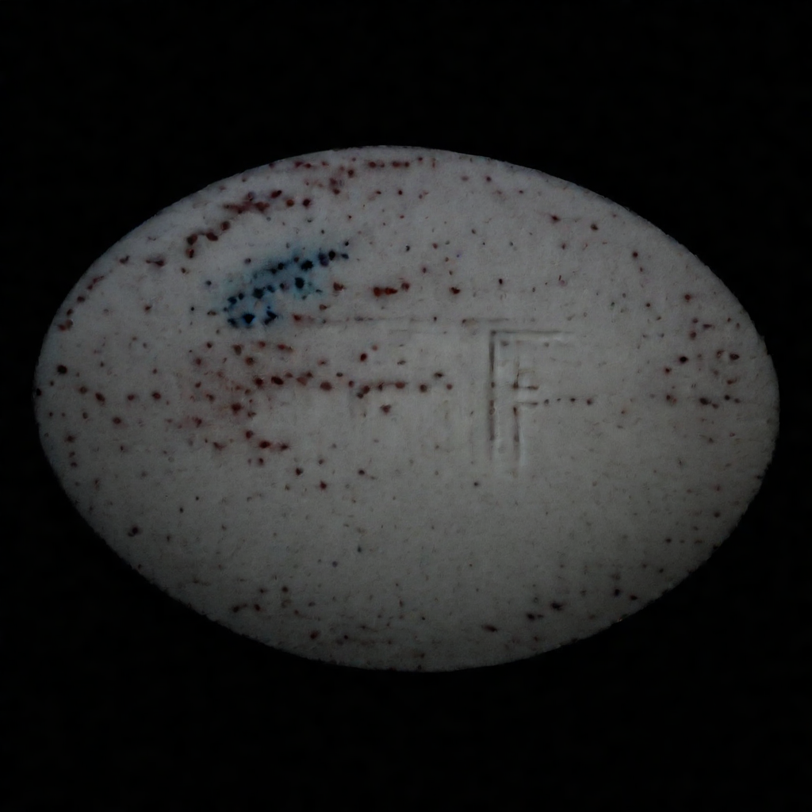

# Fine-Tuning and Evaluation Pipeline for Stable Diffusion XL on Defect Detection

This repository provides a full pipeline for:

- An efficient distributed data loader to load the dataset
- A few-shot dataset sampler
- A script to fine-tuning Stable Diffusion XL using LoRA and/or Textual Inversion
- A script to generate synthetic defect images with the fine-tuned models
- A script to evaluate generated images with standard image quality metrics

---

## Project Structure

```
├── dataset/                # Dataset
├── scripts/                # Bash scripts for fine tunining
├── src/                    # All python codes required for data loading and others
    ├─── io/                # 
    ├─── utils/             # 
├── evaluate.py             # Evaluation script (ISC, FID, KID, PRC)
├── few_shot_sampler.py     # Few-shot dataset sampler
├── inference.py            # Image generation script
├── run_all.py              # A bash script to run all of the steps from sampling to evaluation
├── README.md               # Project documentation
└── requirements.txt        # Dependencies
```

---

## 1. Few-Shot Dataset Sampling

The script **`few_shot_sampler.py`** allows you to create a reduced dataset by randomly sampling a specified number of
examples from the original dataset.

**Usage:**

```bash
python few_shot_sampler.py \
  --num_sample "${NUM_SAMPLES}" \
  --out_dir   "${DATASET_DIR}" \
  --ti_dataset True
```

## 2. Fine-Tuning

You can fine-tune Stable Diffusion XL in two ways:

### **A. LoRA Fine-Tuning**

Fine-tunes the base **Stable Diffusion XL** model using LoRA (Low-Rank Adaptation).  
Best for adapting the model to a custom defect dataset with minimal compute and storage.

**Usage:**

```bash
sh ./scripts/fine-tune.sh "${DEFECT_TYPE}" "${NUM_SAMPLES}"
```

---

### **B. Textual Inversion Fine-Tuning**

Learns new textual embeddings that represent specific defects.  
Best when you want to generate defect-specific images by prompting with the learned token.

**Usage:**

```bash
sh ./scripts/fine-tune-textual-inversion.sh "${DEFECT_TYPE}" "${NUM_SAMPLES}"
```

---

## 3. Image Generation (Inference)

Generates defect images using by loading the LoRA-finetuned model and/or the textual inversion model.

**Features:**

- Choose defect type (via prompt)
- Set number of generated samples
- Specify output directory
- Choose whether to load learned embedding Textual Inversion

**Usage:**

```bash
python inference.py \
  --num_samples "${NUM_SAMPLES}" \
  --out_dir     "${INFER_OUT_DIR}" \
  --lora_dir    "${LORA_ROOT}" \
  --lora_samples "${NUM_SAMPLES}" \
  --enable_ti   True \
  --defect_type "${DEFECT_TYPE}"
```

---

## 4. Quality Evaluation of Generated Images

Evaluate generated images using:

- **ISC** -- Inception Score
- **FID** -- Frechet Inception Distance
- **KID** -- Kernel Inception Distance
- **PRC** -- Precision & Recall for Generative Models

Results are saved to a CSV file in out_dir.

**Usage:**

```bash
python evaluate.py \
  --out_dir            "${EVAL_DIR}" \
  --orig_data_dir      "${TI_DATA_DIR%*-samples}"   \
  --synthetic_data_dir "${INFER_OUT_DIR}/img" \
  --file_name          "results_${DEFECT_TYPE}_${NUM_SAMPLES}s.csv"
```

**Quality of Generated Images Compared to the Actual Images for Color Defects**

```
| Baseline                   |   FID      |   KID    |
|----------------------------|------------|----------|
| Textual Inversion Model    | 299.46	  |  0.378   |
| LORA Fine Tuned            | 300.57	  |  0.409   |
| Pre-trained Model          | 437.56	  |  0.476   |
```

**Qualitative Evaluation:** Comparison of different methods and generated images.

**Caption Used:**
The upper left part of the white pill has three blue spot defects, which is incorrect as the proper pill should have white and red spots. This pill is the wrong type.

From left to right:
<ol>
<li>Original image</li>
<li>Generated by the pretrained model</li>
<li>Generated by LORA fine-tuned model</li>
<li>Fine-tuned by textual inversion (TI) model</li>
</ol>

<p align="center">


</p>
    
  


**Sample Generated Images with Color Defect:**
<p align="center">
  
    
    
    
</p>

**Sample Generated Images with Contamination Defect:**
<p align="center">
    
    
</p>

---
## End-to-End Defect Synthesis & Evaluation Pipeline
The ```run_pipeline.sh``` script automates the entire workflow for generating and evaluating synthetic defect images.
It ties together few-shot sampling, model fine-tuning, inference, and evaluation into a single command.

Instead of manually running each stage of the process, this script allows you to execute the complete pipeline for a given defect type and number of training samples with one command.

```bash
sh run_pipeline.sh <defect_type> <num_samples>
```

it will sequentially:

### 1. Few-Shot Sampling

- Calls ```few_shot_sampler.py``` to create a subset of the dataset with the specified number of samples per defect type.

- Generates both Textual Inversion (TI) and Fine-Tuning (FT) training splits.

### 2. Fine-Tuning (LoRA)

- Trains a Stable Diffusion XL LoRA model on the few-shot dataset.

### 3. Textual Inversion Training

- Trains a textual inversion embedding for the defect type.

### 4. Inference

- Uses the fine-tuned LoRA model (and optionally the TI embedding) to generate synthetic defect images.

### 5. Evaluation

- Runs ```evaluate.py``` to compute ISC, FID, KID, and PRC metrics between real and generated images.

- Saves results in a CSV file with a descriptive filename (e.g., results_color_20s.csv).

## Installation

```bash
git clone https://github.com/badnava-babak/defect-image-generation.git
cd defect-image-generation
pip install -r requirements.txt
sh run_pipeline.sh
```